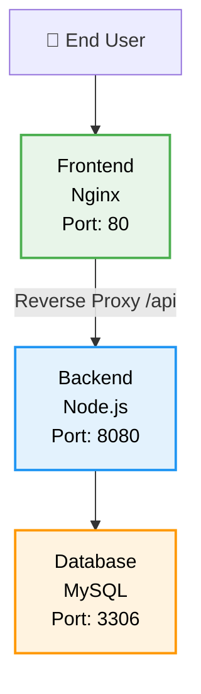

# System Architecture

```mermaid
flowchart TD

    U[👤 End User]

    N["Frontend<br/>Nginx<br/>Port: 80"]

    B["Backend<br/>Node.js<br/>Port: 8080"]

    D["Database<br/>MySQL<br/>Port: 3306"]

    U --> N

    N -->|Reverse Proxy /api| B

    B --> D

    classDef frontend fill:#e8f5e9,stroke:#4caf50,stroke-width:2px,color:#000;
    classDef backend fill:#e3f2fd,stroke:#2196f3,stroke-width:2px,color:#000;
    classDef database fill:#fff3e0,stroke:#ff9800,stroke-width:2px,color:#000;

    class N frontend;
    class B backend;
    class D database;
```
